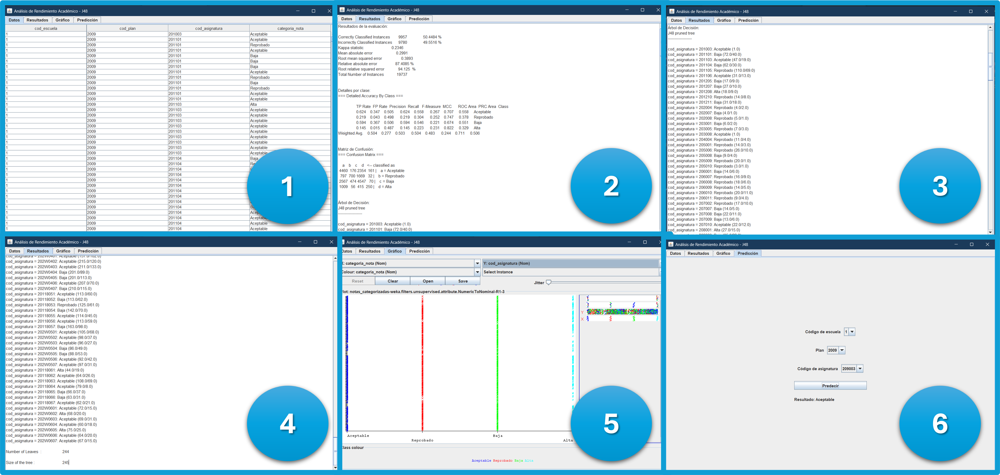

# Probando WEKA en VSC




## 1. Descripción del proyecto
Este repositorio presenta a detalle el procesamiento que fue necesario aplicar a los datos del dataset de calificaciones de los estudiantes universitarios de la facultad **Ingeniería de Sistemas e Informática** de la **Universidad Nacional Mayor de San Marcos**, con la finalidad de prepararlos para el entrenamiento de un árbol de deciciones (algoritmo de clasificación supervisado).

## 2. Estado del proyecto


## 3. Tecnologías utilizadas


## 4. Guía de instalación
1. Agregar las extensiones: ```Language Support for Java (TM) by Red Hat``` y ```Extension Pack for Java``` a su IDE de preferencia.

2. Clonar el repositorio en su IDE:
    ```
    https://github.com/caroSeminario23/EP_EJ3_WEKA.git
    ```

3. Editar el arhivo **launch.json** de la carpeta ```.vscode```, en específico, necesita eliminar el atributo ```"projectName": "Lab_WEKA_1ddf98b6",``` de tal manera que su archivo se visualice así:
    ```
    {
        "version": "0.2.0",
        "configurations": [
            {
                "type": "java",
                "name": "Entrenamiento2",
                "request": "launch",
                "mainClass": "Entrenamiento2",
                "vmArgs": "--add-opens java.base/java.lang=ALL-UNNAMED"
            },
            {
                "type": "java",
                "name": "Entrenamiento",
                "request": "launch",
                "mainClass": "Entrenamiento",
                "vmArgs": "--add-opens java.base/java.lang=ALL-UNNAMED"
            }
        ]
    }
    ```

4. Guardar los cambios y reiniciar el editor.

5. Presionar sobre la palabra **Run** o en el **ícono en forma de triángulo** en la parte superior de la IDE.

## 5. Licencia
[](./LICENSE)

## 6. Autores
- caroSeminario23
- JamilTuncarQ